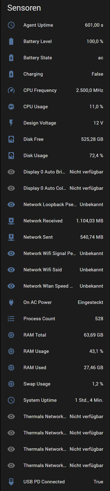
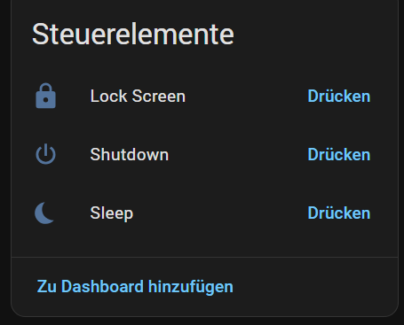
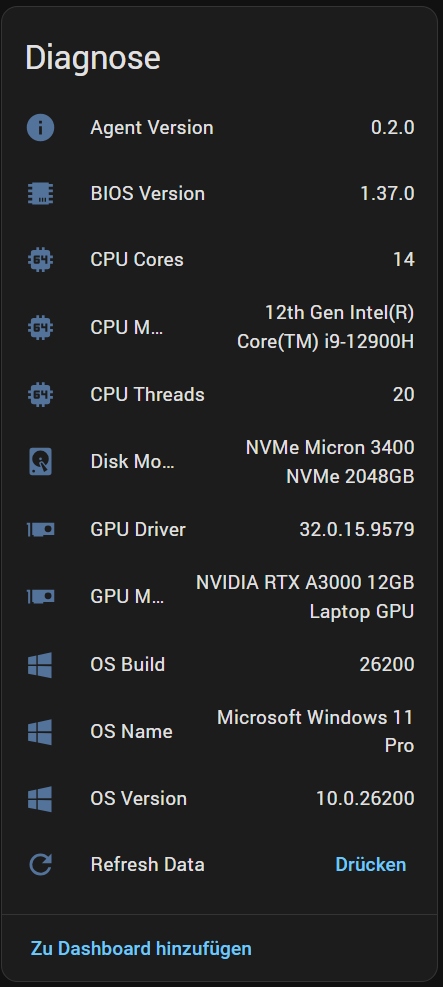
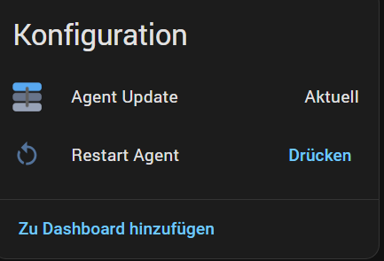

# Desk2HA — Home Assistant Integration

Multi-vendor desktop monitoring integration for [Home Assistant](https://www.home-assistant.io/).

Brings your entire desk — PC, monitors, peripherals — into Home Assistant. Works with the [Desk2HA Agent](https://github.com/maximusIIxII/desk2ha-agent) running on Windows, Linux, or macOS.

## Screenshots

| Sensors | Controls | Diagnostics | Config |
|---------|----------|-------------|--------|
|  |  |  |  |

| Connected Devices |
|-------------------|
|  |

## What you get

- **50+ sensors**: CPU, RAM, disk, battery, GPU, thermals, fan speeds, network, OS info
- **Display controls**: Brightness, contrast, volume, input source, KVM switch, PBP mode
- **Peripheral batteries**: HID, BLE, headsets (via HeadsetControl)
- **Power monitoring**: USB PD charger status, AC adapter wattage
- **Agent updates**: See available updates + install from HA
- **Auto-discovery**: Zeroconf finds agents on your network
- **Dynamic entities**: Only creates entities for metrics your agent actually reports

## Installation

### HACS (recommended)

1. **HACS** → Integrations → ⋮ → **Custom Repositories**
2. URL: `https://github.com/maximusIIxII/hass-desk2ha`
3. Category: **Integration**
4. Install **Desk2HA** and restart HA
5. **Settings** → **Integrations** → **Add Integration** → **Desk2HA**

### Manual

Copy `custom_components/desk2ha/` to your HA `custom_components/` directory and restart.

## Setup

The [Desk2HA Agent](https://github.com/maximusIIxII/desk2ha-agent) must be running on the target machine.

1. Install the agent: `pip install desk2ha-agent`
2. Start it with a config file (see agent README)
3. In HA, add the Desk2HA integration:
   - **URL**: `http://<agent-ip>:9693`
   - **Token**: The auth token from your agent config

Or let Zeroconf auto-discover the agent on your network.

## Entity Platforms

| Platform | Examples |
|----------|---------|
| **Sensor** | CPU Usage, RAM, Battery Level, GPU Model, Fan Speed, Display Model |
| **Binary Sensor** | On AC Power |
| **Number** | Display Brightness, Contrast, Volume (per display) |
| **Select** | Display Input Source, Power State, KVM Switch, PBP Mode |
| **Button** | Refresh Data, Restart Agent |
| **Update** | Agent version check + install |

## Options

In the integration options you can configure:
- **Poll interval**: How often to fetch metrics (default: 30s, min: 10s)

## Requirements

- Home Assistant 2024.12.0+
- [Desk2HA Agent](https://github.com/maximusIIxII/desk2ha-agent) running on the target machine
- Network connectivity between HA and the agent (HTTP port 9693 or MQTT)

## Known Issues

| Issue | Workaround | Status |
|-------|------------|--------|
| **Duplicate sub-devices after upgrade** | Upgrading from pre-sub-device versions leaves orphaned entities. Fix: delete the integration in HA and re-add it. | Known |
| **Display entities show "not available"** | Display controls require the agent to run interactively (not as service) for DDC/CI access. | By design |
| **Logo not visible** | Custom component logos require HA 2026.3+ with `brand/` directory. Older HA versions won't show the icon. | HA limitation |
| **MQTT entities duplicate HTTP entities** | If both HTTP polling and MQTT are active, the same metrics appear twice. Use one transport or the other, not both. | Planned fix |

## Upcoming Features

- **Product images**: Device-specific icons and silhouettes per vendor/model
- **Bluetooth peripherals**: Detect devices connected via Dell Universal Receiver / Logitech Bolt
- **Remote agent installation**: Install and configure the agent from the HA UI via SSH/WinRM
- **Custom Lovelace card**: Dedicated dashboard card showing the full desk overview
- **More vendor plugins**: Corsair iCUE, SteelSeries Sonar, Razer Synapse
- **Webcam controls**: Brightness, contrast, white balance, FOV via UVC
- **Fleet management**: Monitor multiple desks from a single HA instance

## License

Apache-2.0
