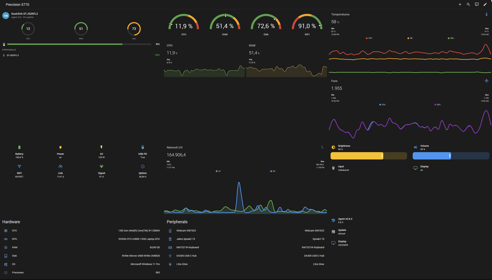

# Desk2HA — Home Assistant Integration

[](https://github.com/maximusIIxII/hass-desk2ha/releases)
[](https://github.com/hacs/integration)
[](LICENSE)
[](https://github.com/maximusIIxII/hass-desk2ha/actions/workflows/ci.yml)

Multi-vendor desktop monitoring integration for [Home Assistant](https://www.home-assistant.io/).

Brings your entire desk — PC, monitors, peripherals — into Home Assistant. Works with the [Desk2HA Agent](https://github.com/maximusIIxII/desk2ha-agent) running on Windows, Linux, or macOS.

## Screenshots

### Dashboard with Desk2HA Card



### Device Control Popup

Click any device in the card to open its control popup with inline sliders, toggles, and dropdowns:


### Connected Devices


## What you get

- **100+ sensors**: CPU, RAM, disk, battery, GPU, thermals, fan speeds, network throughput, WiFi SSID/signal, OS info, uptime, process count
- **Display controls**: Brightness, contrast, volume, input source, power state, color preset, sharpness, RGB gain, black level, audio mute, KVM switch, PBP mode via DDC/CI (per display)
- **Display actions**: Factory reset, factory color reset buttons (per display)
- **Webcam controls**: 13 number entities (brightness, contrast, saturation, sharpness, gain, gamma, zoom, focus, exposure, white balance, pan, tilt, backlight compensation) + 3 switches (autofocus, auto WB, auto exposure) via UVC
- **Headset controls**: Sidetone level, chat mix, LED toggle via HeadsetControl
- **Logitech Litra**: Power, brightness, color temperature as HA light entity
- **Bluetooth peripherals**: Paired BLE + Classic devices with battery levels and connection status
- **Peripheral detection**: USB devices with VID:PID identification (Dell, Logitech, Jabra, Corsair, SteelSeries, Razer)
- **Product images**: Opt-in fetch of real product photos from Dell, Lenovo, HP, Logitech websites
- **Power monitoring**: USB PD charger status, AC adapter wattage, battery charge mode (Lenovo)
- **Sub-devices**: Each display, peripheral, and receiver appears as its own HA device (via_device)
- **Custom Lovelace card**: Dedicated dashboard card with system gauges, thermals, peripherals overview
- **Agent updates**: See available updates + install directly from HA
- **Auto-discovery**: Zeroconf finds agents on your network automatically
- **Agent distribution**: Generate install URL + pairing code, deploy agent from HA config flow
- **Remote install**: Deploy the agent on remote machines via SSH (Linux/macOS) or WinRM (Windows)
- **Fleet management**: Monitor multiple desks with fleet_status, refresh, restart services
- **Workspace blueprints**: Ready-made automations (see [Blueprints](#blueprints))
- **Dynamic entities**: Only creates entities for metrics your agent actually reports
- **Security hardened**: SSH TOFU, XSS prevention, pairing rate limiting, input validation, path traversal protection

## Installation

### HACS (recommended)

1. **HACS** > Integrations > ⋮ > **Custom Repositories**
2. URL: `https://github.com/maximusIIxII/hass-desk2ha`
3. Category: **Integration**
4. Install **Desk2HA** and restart HA
5. **Settings** > **Integrations** > **Add Integration** > **Desk2HA**

### Manual

Copy `custom_components/desk2ha/` to your HA `custom_components/` directory and restart.

## Setup

The [Desk2HA Agent](https://github.com/maximusIIxII/desk2ha-agent) must be running on the target machine.

**Option 1: Manual**
1. Install the agent: `pip install desk2ha-agent`
2. Start it with a config file (see agent README)
3. In HA, add the Desk2HA integration:
   - **URL**: `http://<agent-ip>:9693`
   - **Token**: The auth token from your agent config

**Option 2: Auto-discovery**
The agent advertises via Zeroconf (`_desk2ha._tcp.local.`). HA will discover it automatically.

**Option 3: Agent distribution (Phone Home)**
In the integration setup, choose "Distribute agent". HA generates an install URL with a 6-character pairing code. Open the URL on the target machine — the agent installs and connects back to HA automatically.

**Option 4: Remote install**
Choose "Install agent on remote machine". The integration scans your LAN for reachable hosts (SSH, WinRM, existing agents), then deploys the agent, generates a config, and starts it automatically.

## Entity Platforms

| Platform | Examples |
|----------|---------|
| **Sensor** | CPU Usage, RAM, Battery Level, GPU Model, Fan Speed, WiFi SSID, Network Throughput |
| **Binary Sensor** | Lid Open, On AC Power |
| **Number** | Display Brightness, Contrast, Volume, Sharpness, RGB Gain, Black Level, Keyboard Backlight, Mouse DPI, Webcam Controls (13), Headset Sidetone, Chat Mix |
| **Select** | Display Input Source, Power State, Color Preset, KVM Switch, PBP Mode, Thermal Profile, Battery Charge Mode |
| **Switch** | Auto Brightness, Auto Color Temperature, Audio Mute, Headset LED, Webcam Autofocus/Auto WB/Auto Exposure, BLE Scanning |
| **Button** | Refresh Data, Restart Agent, Lock Screen, Sleep, Shutdown, Restart, Hibernate, Factory Reset, Factory Color Reset |
| **Light** | Display Brightness (dimmable), Logitech Litra (brightness + color temp) |
| **Media Player** | Display Speaker Volume |
| **Update** | Agent version check + install |

## Services

| Service | Description |
|---------|-------------|
| `desk2ha.fleet_status` | Get status of all configured desks (online/offline, versions, collectors) |
| `desk2ha.refresh` | Force-refresh metrics from one or all desks |
| `desk2ha.restart_agent` | Send restart command to a specific agent |
| `desk2ha.wake_on_lan` | Send Wake-on-LAN magic packet via agent |
| `desk2ha.fetch_product_images` | Download product images from manufacturer websites for all desks |

## Blueprints

Ready-made automation blueprints included with the integration. Import them from **Settings > Automations > Blueprints > Import Blueprint**, or they appear automatically when Desk2HA is installed.

| Blueprint | Trigger | Default |
|-----------|---------|---------|
| **Morning Routine** | PC session detected | Lights on, display wake |
| **Lock on Away** | Person leaves home | Lock workstation |
| **Night Shutdown** | Time-based | Shut down PC |
| **Low Battery Alert** | Battery < threshold | Notification | 20% |
| **High CPU Temperature** | CPU temp > threshold for 2 min | Notification | 90 °C |
| **Disk Space Low** | Disk usage > threshold | Notification | 90% |
| **High RAM Usage** | RAM usage > threshold for 5 min | Notification | 90% |

Each blueprint lets you pick the target sensor, threshold, and notification service in the HA UI.

## Options

In the integration options you can configure:
- **Poll interval**: How often to fetch metrics (default: 30s, min: 10s)
- **Fetch product images**: Download product photos from manufacturer websites (opt-in)

## Custom Lovelace Card

Add the Desk2HA card to any dashboard for a complete desk overview:

```yaml
type: custom:desk2ha-card
entity: sensor.desk2ha_<device_key>_cpu_usage
show_system: true
show_thermals: true
show_battery: true
show_peripherals: true
show_displays: true
```

The card shows system gauges (CPU, RAM, disk, WiFi), thermals, battery status, and connected peripherals with Bluetooth battery levels. Registered automatically when the integration loads.

> **Note:** Add the card as a dashboard resource: **Settings** > **Dashboards** > **Resources** > Add `/desk2ha/desk2ha-card.js` as JavaScript Module.

## Device Capabilities

| Device Category | Monitoring | Controls | Notes |
|-----------------|-----------|----------|-------|
| **System (PC)** | CPU, RAM, Disk, Network, Battery, Thermals | Lock, Sleep, Shutdown, Restart, Hibernate | Thermals require Dell Command Monitor or admin |
| **Monitors** | Model, Firmware, Usage Hours | Brightness, Contrast, Volume, Input Source, KVM, Color Preset, RGB Gain, Black Level | DDC/CI must be enabled in OSD |
| **Webcams** | Resolution, FPS | Brightness, Contrast, Zoom, Focus, Pan/Tilt, White Balance, Exposure | Requires `opencv-python` |
| **Headsets** | Battery, Model, Firmware | Sidetone, Chat Mix, LED | Requires `headsetcontrol` (Linux) |
| **Keyboards** | Battery (BT), Backlight | Backlight level | Backlight: Dell WMI or Logitech HID++ |
| **Mice** | Battery (BT), DPI | DPI setting | DPI: Logitech HID++ only |
| **Docks/Hubs** | Model, VID:PID | — | Monitoring only (no standard control API) |
| **USB Power Delivery** | Voltage, Charge Rate, Connected | — | Monitoring only (OS read-only interfaces) |
| **Bluetooth Peripherals** | Battery, Connected, Type | BLE Scan toggle | Only connected devices shown |
| **Lights (Litra)** | Power, Brightness, Color Temp | On/Off, Brightness, Color Temp | Logitech Litra Glow/Beam |

## Known Issues

| Issue | Workaround | Status |
|-------|------------|--------|
| **DDC/CI requires interactive session** | Display controls (brightness, volume, input) only work when the agent runs interactively, not as a Windows Service (Session 0 limitation). | By design |
| **Lovelace card not found** | The card JS is served via HA HTTP, but must also be added as a dashboard resource manually (see above). | Documented |
| **WinRM uses self-signed TLS** | Remote install on Windows accepts self-signed certificates. Use SSH where possible. | Documented |

## Requirements

- Home Assistant 2024.12.0+
- [Desk2HA Agent](https://github.com/maximusIIxII/desk2ha-agent) running on the target machine
- Network connectivity between HA and the agent (HTTP port 9693)

## Upcoming Features

- **Multi-host device tracking**: Peripheral follows user across machines via global device ID ([design doc](https://github.com/maximusIIxII/desk2ha-agent/blob/main/docs/feinkonzept/12-multi-host-tracking.md))
- **Fleet management policies**: Centralized configuration and compliance rules ([design doc](https://github.com/maximusIIxII/desk2ha-agent/blob/main/docs/feinkonzept/13-fleet-management-policies.md))
- **USB PD Dock Monitoring**: Thunderbolt/USB4-specific metrics for docking stations
- **HACS Default Repository**: Approval pending (PR #6850)

## License

Apache-2.0
